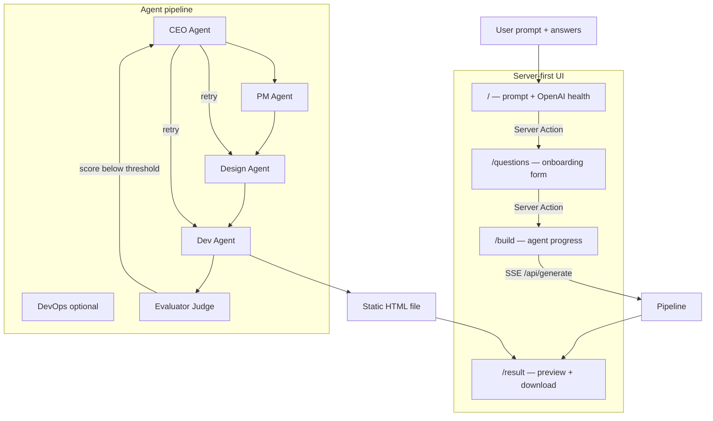

# Agentic Landing Page Builder

A multi-agent system that turns a product prompt into a polished **static HTML landing page**. A **CEO Agent** orchestrates specialist sub-agents; a **Judge (Evaluator) Agent** scores output and triggers improvement loops until quality meets the bar. Agent calls can be traced in **Weights & Biases (Weave)**.

**Live app:** runs at [http://localhost:3001](http://localhost:3001) in development.

## Architecture



### Agents

| Agent | Role |
|-------|------|
| **CEO** | Reads agent roster, sets strategy, activates sub-agents, assigns retries after Judge feedback |
| **PM** | Writes PRD, delegates tasks to Design / Dev / DevOps |
| **Design** | Produces visual spec (colors, typography, layout) |
| **Dev** | Builds single-file static HTML with inline CSS only (no JavaScript) |
| **DevOps** | Deployment config (only when user asks to deploy/host) |
| **Evaluator** | Scores 1–10, lists improvements, triggers CEO retry loop |

Agent prompts live in `web/agents/<Name>/Agent.md` and `Skills.md`.

## Quick start

### 1. Install

```bash
cd web
npm install
```

### 2. Configure environment

Copy the example env file and add your keys:

```bash
# macOS / Linux
cp .env.example .env.local

# Windows PowerShell
copy .env.example .env.local
```

| Variable | Required | Description |
|----------|----------|-------------|
| `OPENAI_API_KEY` | Yes | OpenAI API key — verified live on every home page load |
| `WANDB_API_KEY` | No | W&B API key for Weave tracing |
| `WEAVE_PROJECT` | No | W&B project name (default: `landing-page-builder`) |
| `EVAL_PASS_SCORE` | No | Min score to pass (default: `8`) |
| `MAX_IMPROVE_ITERATIONS` | No | Max revision loops (default: `2`) |

**Never commit `web/.env.local`** — it contains your secrets.

### 3. Run

```bash
npm run dev
```

Open [http://localhost:3001](http://localhost:3001).

`npm run dev` automatically clears the `.next` cache first (`predev` script) to avoid stale JS/CSS chunk errors.

## User flow

1. **`/` — Describe** your product. OpenAI is verified on the server with a timestamped status message.
2. **Continue** via a native HTML form + Server Action (works without client JavaScript).
3. **`/questions`** — Answer 5–6 AI-generated onboarding questions.
4. **`/build`** — Watch agents work in real time (~2–4 minutes for a full run).
5. **`/result?id=...`** — Preview your landing page and **Download HTML**.

If the Judge scores below the threshold, the CEO assigns Design and/or Dev to revise — up to `MAX_IMPROVE_ITERATIONS` times.

### Expected build time

| Step | Model | Typical time |
|------|--------|--------------|
| CEO, PM, Design, Evaluator | gpt-4o-mini | ~10–20 s each |
| Dev (HTML generation) | gpt-4o | ~60–120 s |
| Retry loop (if score &lt; 8) | — | +1–2 min |

## Routes & API

| Route | Purpose |
|-------|---------|
| `/` | Home — live health check + prompt form |
| `/questions` | Onboarding Q&A form |
| `/build` | Agent progress (loads session via `/api/build-session`, streams via `/api/generate`) |
| `/result?id=...` | Preview iframe + download button |
| `GET /api/health` | JSON OpenAI health check |
| `GET /api/build-session` | Returns prompt + answers from cookie session |
| `POST /api/generate` | SSE agent pipeline stream |
| `GET /api/download?id=...` | Download generated HTML file |

## W&B tracing

When `WANDB_API_KEY` is set, [Weave](https://wandb.ai/site/weave) records:

- Every agent op (`CEO`, `PM`, `Design`, `Dev`, `DevOps`, `Evaluator`)
- Pipeline run metadata (scores, iteration count, HTML length)

View traces at [wandb.ai](https://wandb.ai) under your `WEAVE_PROJECT`.

## Project structure

```
web/
├── agents/                  # Agent definitions (Agent.md + Skills.md)
│   ├── CEO/ PM/ Design/ Dev/ DevOps/ Evaluator/
├── app/
│   ├── page.tsx             # Home — server health check + prompt form
│   ├── questions/page.tsx   # Onboarding form
│   ├── build/page.tsx       # Agent progress UI
│   ├── result/page.tsx      # Preview + download
│   ├── actions.ts           # Server Actions (submit prompt / answers)
│   └── api/
│       ├── health/          # JSON health check
│       ├── build-session/   # Session data for build page
│       ├── generate/        # SSE streaming pipeline
│       └── download/        # HTML file download
├── components/              # Forms + submit button
├── lib/
│   ├── health.ts            # verifyOpenAI() — server + API
│   ├── session.ts           # Cookie session between steps
│   ├── onboarding.ts        # Generate onboarding questions
│   ├── result-store.ts      # Save/load generated HTML
│   ├── agents.ts            # LLM calls per agent
│   ├── orchestrator.ts      # CEO loop + full pipeline
│   └── tracer.ts            # W&B Weave integration
└── public/
    ├── app.css              # Fallback dark-theme styles (always loads)
    └── build-stream.js      # Build page SSE client (no React required)
```

## Customizing agents

Edit `web/agents/<Agent>/Agent.md` and `Skills.md` to change behavior without touching code. The CEO reads the full roster at runtime and decides which agents to activate.

## Production build

```bash
cd web
npm run build
npm start
```

## Troubleshooting

### Port already in use (`EADDRINUSE`)

Only one dev server can run on port 3001.

```powershell
# Windows — find and kill the process
netstat -ano | findstr :3001
Stop-Process -Id <PID> -Force
npm run dev
```

### UI looks unstyled or stuck

1. Stop the dev server (Ctrl+C).
2. Run `npm run dev` again (clears `.next` automatically).
3. Hard-refresh the browser: `Ctrl+Shift+R`.

### Agents stuck on "Waiting…"

- Ensure only one `npm run dev` is running.
- Check the browser console for errors on `/build`.
- Confirm `web/.env.local` has a valid `OPENAI_API_KEY`.

### "Session expired" on `/build` or `/questions`

The cookie session lasts 1 hour. Start again from `/`.

## Deploy on Render

### Service settings (Render dashboard)

| Setting | Value |
|---------|--------|
| **Root Directory** | `web` |
| **Runtime** | Node |
| **Build Command** | `npm install && npm run build` |
| **Start Command** | `npm start` |
| **Instance type** | Free or Starter (builds take 2–4 min per page; Free tier may sleep) |

Connect your GitHub repo, set **Root Directory** to `web`, then add environment variables below.

### Environment variables — **5 total** (minimum **1** required)

| # | Key | Required | Example / default |
|---|-----|----------|-------------------|
| 1 | `OPENAI_API_KEY` | **Yes** | `sk-proj-...` |
| 2 | `WANDB_API_KEY` | No | Your W&B key (for tracing) |
| 3 | `WEAVE_PROJECT` | No | `landing-page-builder` |
| 4 | `EVAL_PASS_SCORE` | No | `8` |
| 5 | `MAX_IMPROVE_ITERATIONS` | No | `2` |

**Optional (recommended on Render):**

| Key | Value |
|-----|--------|
| `NODE_VERSION` | `20` |

Render sets `PORT` automatically — do **not** add a PORT variable. The app uses `next start`, which reads Render's `PORT`.

### After deploy

1. Open your Render URL (e.g. `https://your-app.onrender.com`).
2. Home page should show **OpenAI verified at [time]** in green.
3. Run through prompt → questions → build → result.

**Note:** Generated HTML is stored on the server's local disk (`.results/`). Files are lost when the service redeploys or restarts — users should download their HTML from `/result`.

## What to commit (GitHub)

**Include:** source code, `web/.env.example`, `README.md`, config files.

**Exclude (already in `.gitignore`):**

- `web/.env.local` — API keys
- `web/node_modules/`, `web/.next/`
- `web/.results/` — generated HTML artifacts
- IDE/local config folders (see `.gitignore`)

```bash
git add .
git commit -m "Your message"
git push origin main
```

## License

MIT — see repository for details.
