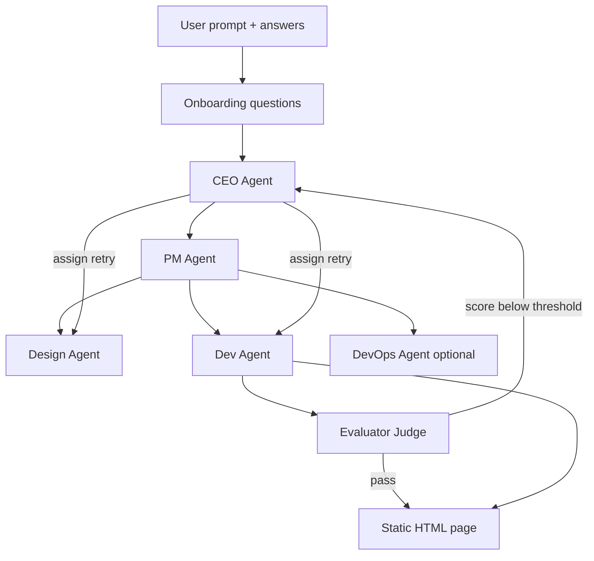

# Agentic Landing Page Builder

A multi-agent system that turns a product prompt into a polished static landing page. A **CEO Agent** orchestrates specialist sub-agents; a **Judge (Evaluator) Agent** scores output and triggers improvement loops until quality meets the bar. Every agent call is traced in **Weights & Biases (Weave)**.

## Architecture



### Agents

| Agent | Role |
|-------|------|
| **CEO** | Reads agent roster, sets strategy, activates sub-agents, assigns retries after Judge feedback |
| **PM** | Writes PRD, delegates tasks to Design / Dev / DevOps |
| **Design** | Produces visual spec (colors, typography, layout) |
| **Dev** | Builds single-file HTML with inline CSS/JS |
| **DevOps** | Deployment config (only when user asks to deploy/host) |
| **Evaluator** | Scores 1–10, lists improvements, triggers CEO retry loop |

Agent prompts live in `web/agents/<Name>/Agent.md` and `Skills.md`.

## Quick start

### 1. Install

```bash
cd web
npm install
```

### 2. Configure environment

Copy the example env file and add your keys:

```bash
cp .env.example .env.local
```

| Variable | Required | Description |
|----------|----------|-------------|
| `OPENAI_API_KEY` | Yes | OpenAI API key (verified live via `/api/health`) |
| `WANDB_API_KEY` | No | W&B API key for Weave tracing |
| `WEAVE_PROJECT` | No | W&B project name (default: `landing-page-builder`) |
| `EVAL_PASS_SCORE` | No | Min score to pass (default: `8`) |
| `MAX_IMPROVE_ITERATIONS` | No | Max revision loops (default: `2`) |

### 3. Run

```bash
npm run dev
```

Open [http://localhost:3001](http://localhost:3001).

## User flow

1. **Describe** your product in a free-form prompt.
2. **Answer** 5–6 targeted onboarding questions (tone, audience, CTA, etc.).
3. **Watch** each agent work in its own lane (CEO → PM → Design → Dev → Evaluator).
4. **Preview** the generated page; download as `landing-page.html`.

If the Judge scores below the threshold, the CEO assigns Design and/or Dev to revise — up to `MAX_IMPROVE_ITERATIONS` times.

## W&B tracing

When `WANDB_API_KEY` is set, [Weave](https://wandb.ai/site/weave) records:

- Every agent op (`CEO`, `PM`, `Design`, `Dev`, `DevOps`, `Evaluator`)
- Pipeline run metadata (scores, iteration count, HTML length)

View traces at [wandb.ai](https://wandb.ai) under your `WEAVE_PROJECT`.

## Project structure

```
web/
├── agents/           # Agent definitions (Agent.md + Skills.md)
│   ├── CEO/
│   ├── PM/
│   ├── Design/
│   ├── Dev/
│   ├── DevOps/
│   └── Evaluator/
├── app/
│   ├── api/onboard/  # Deep onboarding questions
│   ├── api/generate/ # SSE streaming pipeline
│   └── page.tsx      # UI with per-agent lanes
└── lib/
    ├── agents.ts     # LLM calls per agent
    ├── orchestrator.ts  # CEO loop + pipeline
    ├── tracer.ts     # W&B Weave integration
    └── types.ts
```

## Customizing agents

Edit `web/agents/<Agent>/Agent.md` and `Skills.md` to change behavior without touching code. The CEO reads the full roster at runtime and decides which agents to activate.

## Production build

```bash
npm run build
npm start
```
